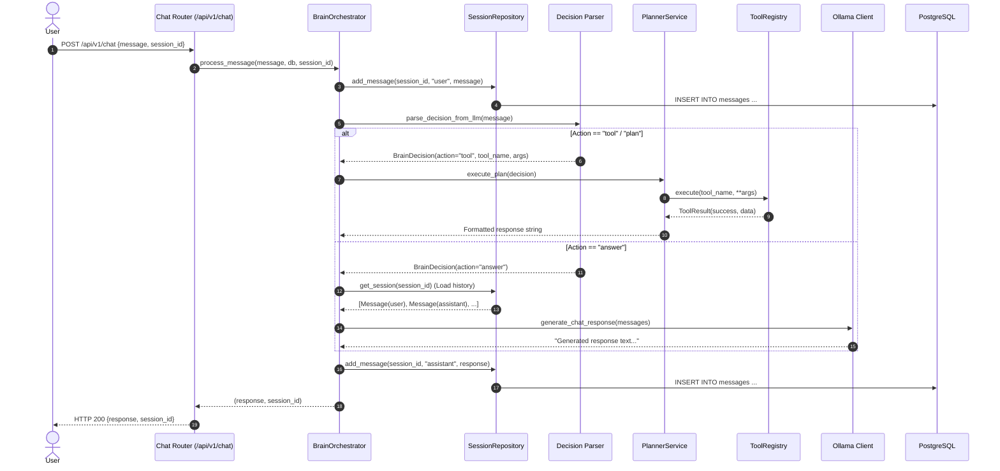
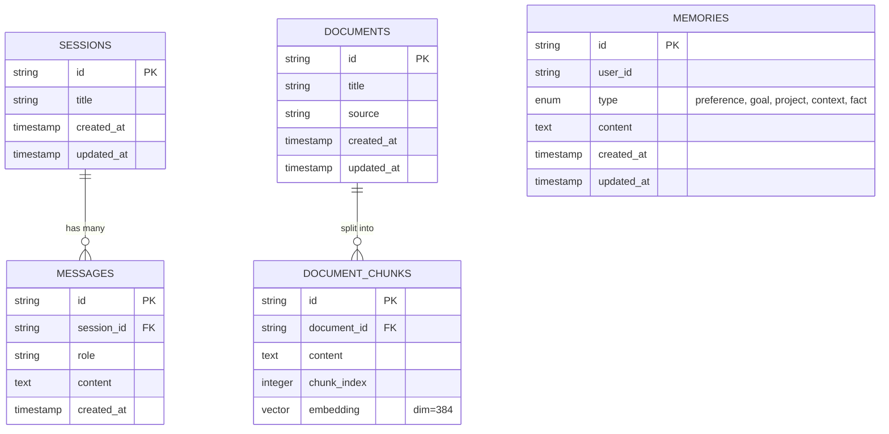

# 🏛️ System Architecture: Sovereign Personal AI Brain

Welcome to the architectural documentation for the **Sovereign Personal AI Brain API**. This document outlines the technical design, data flows, domain modules, and database structures that power the system.

---

## 1. High-Level Vision & Core Principles

1. **Complete Data Sovereignty**: All AI reasoning is executed locally through **Ollama**. No user queries or private knowledge are transmitted to third-party cloud APIs (e.g., OpenAI, Anthropic, Gemini).
2. **Cognitive Separation of Concerns**: The LLM is not just a chatbot. It is a reasoning engine orchestrating:
   - **Episodic Memory**: Past conversation threads and context.
   - **Semantic Knowledge (RAG)**: Private documents and notes indexed with vector embeddings.
   - **Long-Term Memory**: Persistent personal facts, user preferences, and goals.
   - **Actionable Tools**: Concrete capabilities (calculator, web scraper, local filesystem).
3. **Asynchronous by Default**: Built on **FastAPI** and **SQLAlchemy 2.0 (AsyncIO)** with `psycopg 3` for maximum throughput and non-blocking I/O.

---

## 2. System Architecture Diagram

```mermaid
flowchart TD
    subgraph Frontend["Frontend / Clients"]
        Web[Next.js / React Client]
        Docs[Swagger UI / ReDoc]
    end

    subgraph API["FastAPI Gateway (Port 3009)"]
        Main[main.py & CORSMiddleware]
        R_Chat[/api/v1/chat]
        R_Sess[/api/v1/sessions]
        R_Mem[/api/v1/memories]
        R_Know[/api/v1/knowledge]
        R_Health[/api/v1/health]
    end

    subgraph Brain["Cognitive Layer (app.modules.brain)"]
        Orch[BrainOrchestrator]
        Decider[Decision Parser]
        Planner[PlannerService]
    end

    subgraph Domain["Domain Modules"]
        MemMod["Memory Module<br/>(Preferences, Facts, Goals)"]
        KnowMod["Knowledge Module<br/>(Chunking & pgvector RAG)"]
        ToolMod["Tools Module<br/>(ToolRegistry & BaseTool)"]
        SessMod["Sessions Module<br/>(History & Threads)"]
    end

    subgraph Storage["Storage Layer (Port 5434)"]
        DB[(PostgreSQL 16 + pgvector)]
    end

    subgraph LocalAI["Local AI Provider (Port 11434)"]
        Ollama[Ollama Server]
        ModelChat["qwen3 (Chat/Reasoning)"]
        ModelEmbed["embeddinggemma (Vectors)"]
    end

    Web --> Main
    Docs --> Main
    Main --> R_Chat & R_Sess & R_Mem & R_Know & R_Health

    R_Chat --> Orch
    Orch --> Decider
    Decider -->|Requires Action| Planner
    Planner --> ToolMod
    Orch --> MemMod
    Orch --> KnowMod
    Orch --> SessMod

    Orch -->|Prompt & History| Ollama
    KnowMod -->|Embedding Generation| Ollama
    Ollama --> ModelChat & ModelEmbed

    MemMod & KnowMod & SessMod --> DB
```

---

## 3. Cognitive Flow: Lifecycle of a Prompt

When a user submits a message, the request travels through the following lifecycle:



---

## 4. Module Responsibilities

### 4.1. Core (`src/app/core`)
- **`config.py`**: Centralized configuration management using `pydantic-settings`. Loads environment variables from `.env` and Docker container environment overrides.
- **`database.py`**: Sets up the async SQLAlchemy engine (`postgresql+psycopg://`) and provides the `get_db` FastAPI dependency for request-scoped database sessions.

### 4.2. Infrastructure (`src/app/infrastructure`)
- **`ollama/chat.py`**: Async HTTP client using `httpx` communicating with Ollama.
  - `generate_chat_response()`: One-shot non-streaming completions.
  - `stream_chat_response()`: Asynchronous generator yielding tokens for Server-Sent Events (SSE).

### 4.3. Domain Modules (`src/app/modules`)

#### **`brain` (Cognitive Hub)**
- Orchestrates multi-step agent behavior.
- `decisions.py`: Classifies user intent (`answer`, `tool`, `memory_search`, `plan`).
- `planner.py`: Dispatches execution to registered tools or retrieval systems.

#### **`chat` (Conversational Entrypoints)**
- Exposes `POST /api/v1/chat` and `POST /api/v1/chat/stream`.
- Handles real-time SSE streaming.

#### **`sessions` (Thread & History Management)**
- Tracks distinct conversation sessions with auto-titling based on the first user message.
- Uses `selectinload` for eager loading of messages to optimize async performance.

#### **`memory` (Long-Term User Memory)**
- Stores structured memories categorized into:
  - `preference`: (e.g., "Prefers Python over TypeScript")
  - `goal`: (e.g., "Wants to build a local AI assistant")
  - `project`: (e.g., "Working on the Sovereign Brain project")
  - `context`: (e.g., "Running on Windows 11 with Docker Desktop")
  - `fact`: (e.g., "Birthday, timezone, etc.")

#### **`knowledge` (RAG & Semantic Retrieval)**
- **Ingestion**: Accepts text documents, splits them into indexable chunks, and requests embeddings from Ollama.
- **Storage**: Uses `pgvector` (`VECTOR(dim=384)`) for vector storage.
- **Retrieval**: Performs cosine similarity queries (`<=>` operator) against PostgreSQL to augment generation prompts.

#### **`tools` (Action Registry)**
- Abstract `BaseTool` contract that all capabilities implement.
- `ToolRegistry` pattern allowing dynamic discovery and safe execution of tools (e.g., `calculator`, `web_search`, `read_file`, `write_file`).

---

## 5. Database Schema (Entity-Relationship Diagram)


